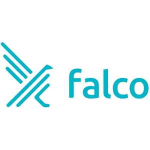

# awesome-falco 

A curated list of Falco related tools, frameworks and articles

## Contents

- [Official Projects](#official-projects)
  - [Repositories](#repositories)
  - [Docs](#docs)
  - [Blogs and Articles](#blogs-and-articles)
  
## Official projects

### Repositories

- [Falco](https://github.com/falcosecurity/falco) - Cloud Native Runtime Security
- [Falcosidekick](https://github.com/falcosecurity/falcosidekick) - A simple daemon to help you with falco's outputs

### Docs

- [Falco](https://falco.org/docs/) - Official Falco documentation

### Blogs and Articles

- [Falco](https://falco.org/blog/) - Official blog for the Falco project
